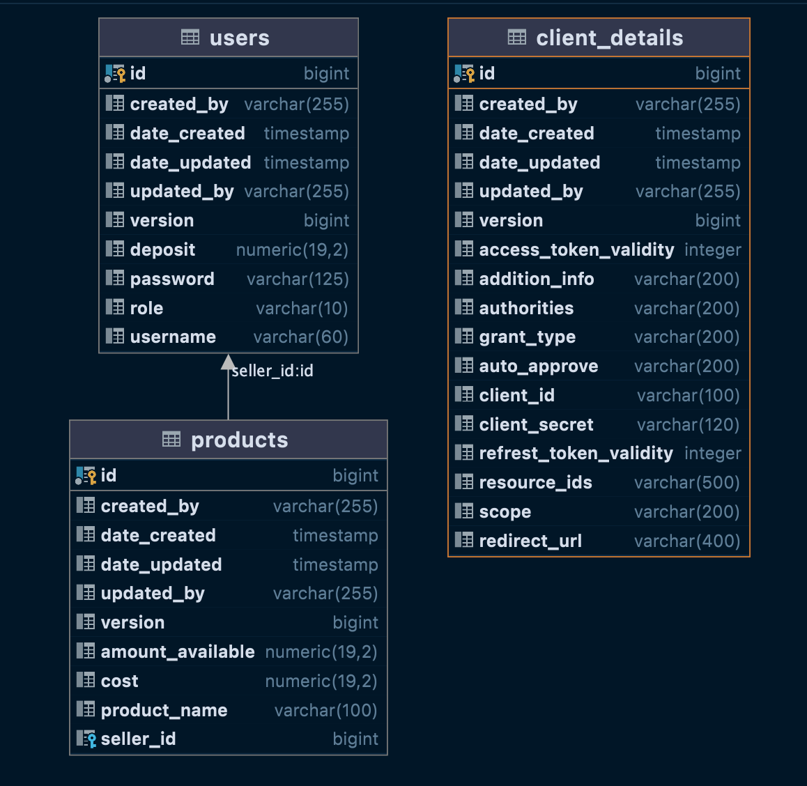
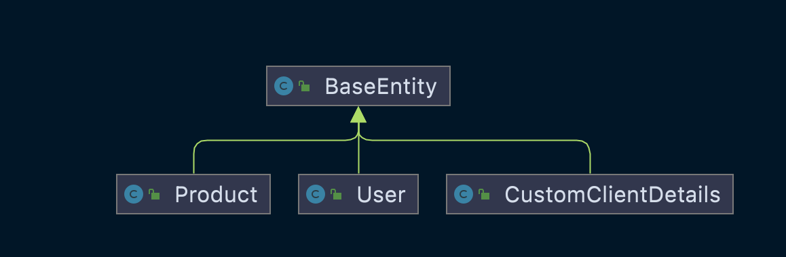

Vending Machine API.

Background:

This application is to enable buyer and seller perform basic processes on the system i.e. buying and selling of 
items of the system and making payment and also depositing money into account via the vending machine.

Technology Stack:
- Java
- Spring Boot
- Spring security (Oauth2)
- Spring data Jpa
- Open API documentation (Swagger)
- JUnit 5
- Database (Postgres SQL)
- Internationalization i18n

Database Structure:

UML Diagram
